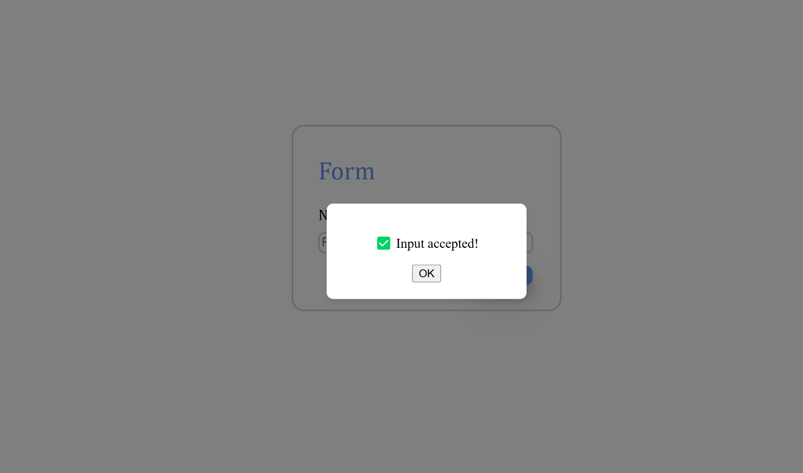

# Flarmio project - The form

This is a solution for Flarmio's Junior web developer's exercise.

## Table of contents

- [Overview](#overview)
  - [The challenge](#the-challenge)
  - [Screenshot](#screenshot)
  - [Links](#links)

## Overview

### The challenge

Users should be able to:

- Test the input of a simple submit type form. If the input given by the user is greater than 10, it's accepted, otherwise it's not. Either way, the users get notified with a message from a pop-up window. 
- Experience this app in both mobile and desktop design.

### Screenshot

Desktop design

Mobile S design

Mobile M-L-Tablet design

### Links

- Solution URL: [https://github.com/johnsavvidis/Flarmio-project]
- Live Site URL: [https://johnsavvidis.github.io/Flarmio-project/]